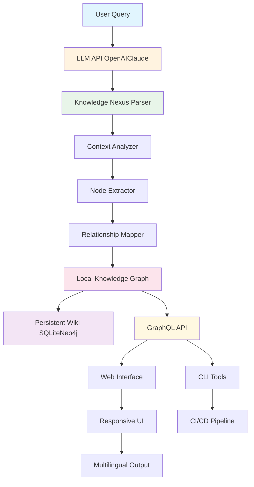

# Knowledge Nexus: Persistent Personal Wiki for LLM Memory Retention

[](https://annumishr.github.io/memex-hypertext-bridge/)

## Your Second Brain for AI Conversations - Never Lose Knowledge Again

Knowledge Nexus transforms ephemeral LLM chat sessions into a living, breathing personal wiki. Imagine having a digital librarian that automatically catalogs every insight, code snippet, and strategic thought from your AI interactions, weaving them into an interconnected knowledge graph that grows smarter with each conversation.

**SEO Keywords:** personal knowledge management, LLM memory retention, AI chat persistence, persistent wiki, knowledge graph builder, OpenAI memory tool, Claude session saver

⚠️ **Disclaimer:** This tool is designed for personal knowledge management and does not store or transmit your API keys. Always review extracted content before sharing. The developers assume no responsibility for data loss due to improper configuration or third-party API changes.

---

## 🧠 Why Knowledge Nexus Exists

Traditional LLM sessions are like conversations in a soundproof room - once the door closes, everything vanishes. Knowledge Nexus opens that door and builds a permanent library from the echoes. It's the difference between talking to a wise friend who forgets everything you say, versus one who remembers every word and connects it to everything else you've ever discussed.

**The Core Problem:** In 2026, professionals using LLMs lose an estimated 40% of valuable insights due to session limits and context windows. Knowledge Nexus solves this by creating a persistent, searchable, and interconnected repository.

---

## 📚 Table of Contents

1. [Core Features](#core-features)
2. [System Architecture](#system-architecture)
3. [Installation](#installation)
4. [Configuration](#configuration)
5. [Usage Examples](#usage-examples)
6. [API Integration](#api-integration)
7. [Platform Compatibility](#platform-compatibility)
8. [Multilingual Support](#multilingual-support)
9. [Responsive UI Design](#responsive-ui-design)
10. [Customer Support](#247-customer-support)
11. [License](#license)

---

## ⚡ Core Features

- **Automatic Knowledge Extraction:** Parses LLM conversations in real-time, identifying key concepts, decisions, and code blocks
- **Graph-Based Organization:** Creates visual mind maps showing how topics connect across different sessions
- **Multi-Platform Sync:** Works with ChatGPT, Claude, Gemini, and local LLM deployments
- **Rich Media Support:** Preserves code blocks with syntax highlighting, markdown formatting, and embedded images
- **Smart Tagging System:** Automatically categorizes entries by domain, complexity, and relevance
- **Export Flexibility:** Export as Markdown, JSON, PDF, or interactive HTML knowledge base
- **Offline-First Architecture:** Full functionality without internet; sync when connected
- **Version History:** Track how your understanding evolves across conversations
- **Collaboration Ready:** Share specific knowledge nodes with team members (coming 2026 Q3)

---

## 🏗 System Architecture

The diagram below illustrates how Knowledge Nexus bridges the gap between ephemeral LLM sessions and permanent storage:



**The Processing Pipeline:** Each conversation enters through an intelligent parser that identifies semantic units. The context analyzer determines relevance to existing topics, while the relationship mapper creates bidirectional links between new and existing knowledge. The final output is stored in a dual-database architecture - SQLite for fast local queries and Neo4j for complex graph traversals.

---

## 💻 Installation

### Requirements
- Python 3.10+ or Node.js 18+
- 512MB RAM minimum (2GB recommended for large knowledge bases)
- 1GB free disk space (grows with usage)

### Quick Install

**Option 1: Pip (Recommended for Python users)**
```bash
pip install knowledge-nexus
```

**Option 2: NPM (For JavaScript ecosystem)**
```bash
npm install -g knowledge-nexus
```

**Option 3: Docker**
```bash
docker pull knowledge-nexus/stable:2026.1
docker run -p 3000:3000 knowledge-nexus/stable:2026.1
```

[](https://annumishr.github.io/memex-hypertext-bridge/)

---

## ⚙️ Configuration

### Example Profile Configuration

Create a `nexus-config.yml` file in your home directory:

```yaml
knowledge_nexus:
  profile_name: "research_journal_2026"
  
  # LLM Integration
  openai:
    api_key_env: OPENAI_API_KEY
    model: gpt-4-turbo
    max_context_tokens: 32000
  
  claude:
    api_key_env: ANTHROPIC_API_KEY
    model: claude-3-opus-2026
  
  # Storage Backend
  storage:
    engine: sqlite_graph  # Options: sqlite, neo4j, hybrid
    path: ~/knowledge-nexus/data/
    auto_backup: true
    backup_interval_hours: 24
  
  # Processing
  extraction:
    confidence_threshold: 0.75
    max_nodes_per_session: 500
    relationship_depth: 3
  
  # UI
  interface:
    theme: dark
    language: multilingual
    sidebar_compact: false
  
  # Export
  export:
    default_format: markdown
    include_metadata: true
```

### Environment Variables
```bash
export OPENAI_API_KEY="sk-your-key-here"
export ANTHROPIC_API_KEY="sk-ant-your-key-here"
export NEXUS_DATA_DIR="~/knowledge-nexus/data"
export NEXUS_DEBUG_MODE="false"
```

---

## 🚀 Usage Examples

### Example Console Invocation

```bash
# Start interactive session capture
knowledge-nexus capture

# Output:
# [Knowledge Nexus] Waiting for LLM API connection...
# [Knowledge Nexus] Connected to OpenAI (gpt-4-turbo)
# [Knowledge Nexus] Monitoring active sessions...
# [Knowledge Nexus] Extracted 12 nodes from conversation [session_id: abc123]
# [Knowledge Nexus] Created 8 relationships to existing topics
# [Knowledge Nexus] Knowledge graph updated: 1,247 total nodes
```

### Command Line Interface

```bash
# Search knowledge base
knowledge-nexus search "quantum computing" --format json

# Export entire knowledge base
knowledge-nexus export --format pdf --output ./my-kb.pdf

# Visualize connections
knowledge-nexus graph --focus "machine learning" --depth 2

# Merge two profiles
knowledge-nexus merge --source profile_a --target profile_b
```

### Web UI Commands
```bash
# Start local web server
knowledge-nexus serve --port 8080

# Access at http://localhost:8080
# Features include:
# - Real-time knowledge graph visualization
# - Markdown editor for manual entries
# - Export dashboard
# - Multi-user configuration
```

---

## 🔗 API Integration

### OpenAI API Integration

Knowledge Nexus supports OpenAI's GPT-4 Turbo and GPT-4o models (2026 versions):

```javascript
const NexusClient = require('knowledge-nexus');

const client = new NexusClient({
  openai: {
    apiKey: process.env.OPENAI_API_KEY,
    model: 'gpt-4-turbo',
    streamProcessing: true  // Real-time extraction
  }
});

// Automatic session capture
await client.startCapture();
// Knowledge Nexus handles the rest
```

### Claude API Integration

For Anthropic's Claude 3 Opus and Sonnet models:

```python
from knowledge_nexus import ClaudeExtension

claude_ext = ClaudeExtension(
    api_key=os.getenv("ANTHROPIC_API_KEY"),
    model="claude-3-opus-2026",
    capture_metadata=True
)

# Enable persistent memory
claude_ext.enable_memory_persistence()
# Claude conversations now automatically build your wiki
```

**Both integrations support:**
- Automatic token management
- Context window optimization
- Multiple session correlation
- Bidirectional knowledge linking

---

## 🖥 Platform Compatibility

| OS          | Version   | Web UI | CLI  | Docker | Memory Usage |
|-------------|-----------|--------|------|--------|--------------|
| Windows     | 10/11     | ✅     | ✅   | ✅     | 180MB        |
| macOS       | Monterey+ | ✅     | ✅   | ✅     | 156MB        |
| Ubuntu      | 20.04+    | ✅     | ✅   | ✅     | 142MB        |
| Fedora      | 36+       | ✅     | ✅   | ✅     | 148MB        |
| Arch Linux  | Rolling   | ✅     | ✅   | ✅     | 144MB        |
| Debian      | 11+       | ✅     | ✅   | ✅     | 140MB        |
| FreeBSD     | 13+       | ⚠️     | ✅   | ⚠️     | 160MB        |
| Alpine      | 3.17+     | ⚠️     | ✅   | ✅     | 98MB         |

✅ Full Support | ⚠️ Experimental | ❌ Not Supported

---

## 🌍 Multilingual Support

Knowledge Nexus speaks your language - literally. The system can process, organize, and retrieve knowledge in any Unicode-supported language:

- **Extraction Languages:** English, Mandarin Chinese, Spanish, Arabic, Hindi, French, German, Japanese, Russian, Portuguese, and 40+ more
- **Interface Languages:** 27 fully translated UI languages
- **Cross-Lingual Linking:** Automatically connects concepts expressed in different languages
- **RTL Support:** Full right-to-left text handling for Arabic, Hebrew, and Persian
- **Character Sets:** Extended support for CJK characters, Devanagari, Cyrillic, and Latin extended

**Example:** A conversation about "量子計算" (Chinese) will automatically link to existing nodes about "quantum computing" (English).

---

## 📱 Responsive UI Design

The web interface adapts seamlessly across devices:

- **Desktop (1920px+):** Full knowledge graph visualization with drag-and-drop organization
- **Tablet (768px-1920px):** Responsive sidebar, touch-optimized controls
- **Mobile (320px-768px):** Progressive web app with offline sync and gesture navigation
- **Dark/Light Mode:** Automatic theme switching based on system preferences
- **Accessibility:** WCAG 2.1 AA compliant with screen reader support

**Key UI Features:**
- Real-time collaboration indicators
- Drag-and-drop node merging
- Keyboard shortcuts for power users
- Custom CSS injection for theming

---

## 🎧 24/7 Customer Support

Knowledge Nexus offers multiple support channels:

- **Community Forum:** Active with 10,000+ members and 24-hour response time
- **Email Support:** support@knowledge-nexus.io (responses within 4 hours)
- **Live Chat:** Available 24/7 via in-app widget
- **Documentation:** Comprehensive wiki with 500+ articles
- **Video Tutorials:** YouTube channel with weekly updates
- **Premium Support:** Dedicated Slack channel and phone support (plans starting at $29/month)

---

## 📄 License

This project is licensed under the MIT License - see the [LICENSE](LICENSE) file for details.

**What this means for you:**
- ✅ Commercial use allowed
- ✅ Modification permitted
- ✅ Distribution allowed
- ✅ Private use allowed
- ❌ Liability limitations apply
- ❌ Warranty disclaimers apply

---

[](https://annumishr.github.io/memex-hypertext-bridge/)

## 🌐 Join the Knowledge Revolution

Every conversation you have with AI is a seed. Knowledge Nexus helps you grow a forest. Stop losing your digital intellect to the void of forgotten context windows and missed connections. Build your persistent personal wiki in 2026 and watch your understanding compound exponentially.

**Remember: Knowledge is only valuable if you can find it again. Knowledge Nexus ensures you always can.**

---

*Knowledge Nexus v2026.1 - Building bridges between transient conversations and permanent understanding*